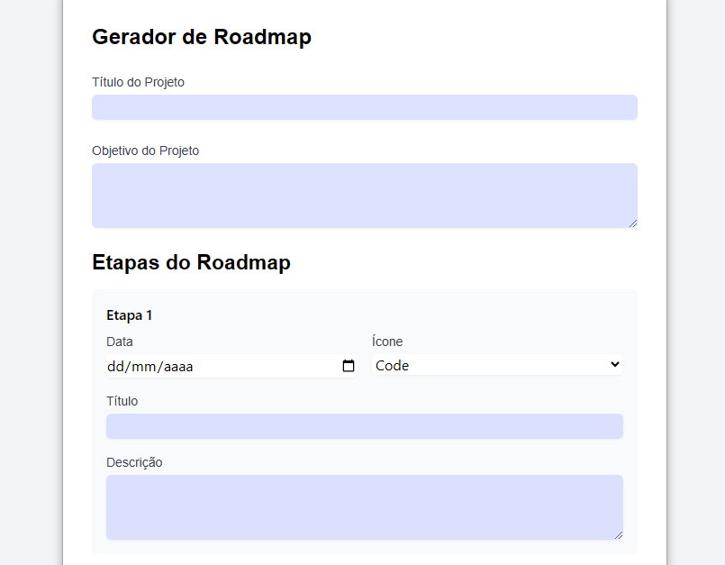
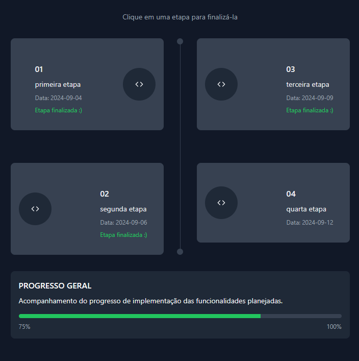

# Relatório de Alterações
Este documento detalha as alterações recentes realizadas nos arquivos principais do projeto: `index.html`, `style.css` e `script.js`.

  
  

## Alterações na `index.html`

### Adição de Estilo e Script
- Inclusão de links para novos arquivos CSS e JS para suportar as novas funcionalidades e estilos.

### Modificações no Layout
- Reestruturação dos elementos, com ajustes em containers e divs para melhorar a organização e a aparência geral.

### Novos Componentes e Funcionalidades
- Adição de novos componentes, como formulários e seções, para expandir a funcionalidade do site.

### Mudanças na Interatividade
- Implementação de novos eventos e funcionalidades em JavaScript para aprimorar a interação do usuário.

## Alterações na `style.css`

### Novas Regras de Estilo
- Inclusão de regras de estilo para os novos componentes e seções adicionados, visando um design mais moderno e coeso.

### Ajustes de Layout
- Atualizações nas propriedades de layout, incluindo `display`, `margin`, `padding` e `flexbox`, para melhorar a responsividade e a aparência.

### Melhorias de Design
- Atualizações em cores, fontes e outros detalhes visuais para um design mais harmonioso e atraente.

## Alterações no `script.js`

### Novas Funções e Métodos
- Implementação de novas funções JavaScript para adicionar funcionalidades e melhorar a interação do site.

### Ajustes em Funções Existentes
- Atualizações em funções já existentes para garantir compatibilidade com as novas alterações de layout e estilo.

### Correções de Bugs
- Correção de problemas identificados e otimização do código JavaScript para melhorar a performance e a funcionalidade geral.
